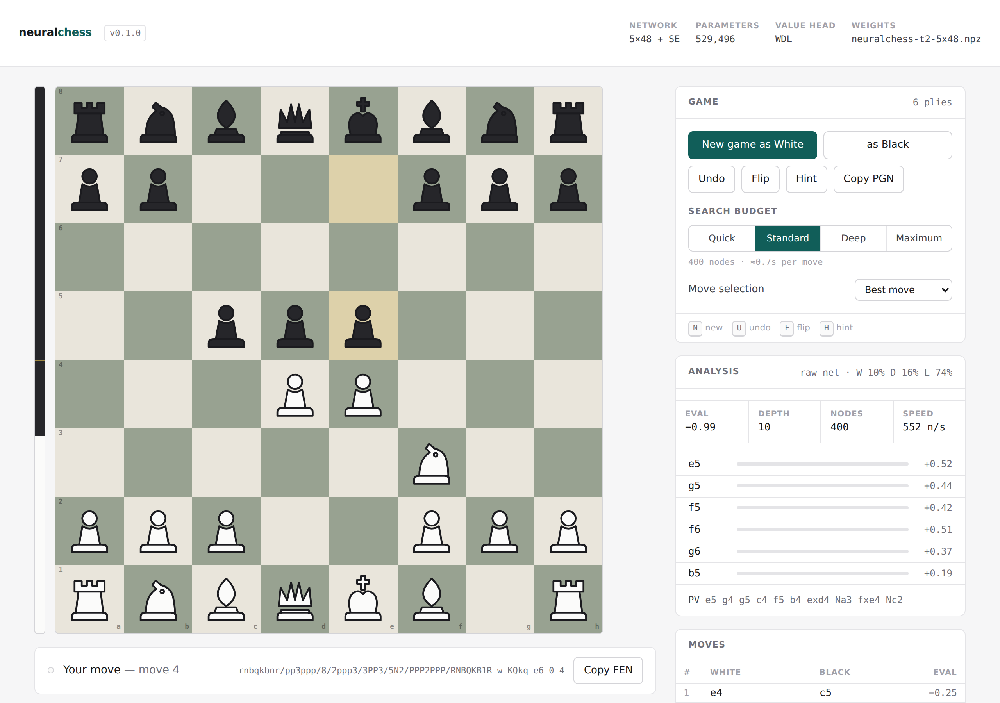
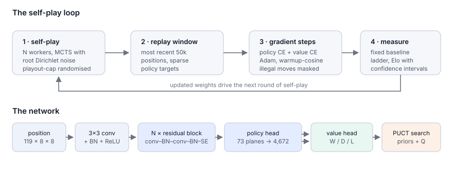
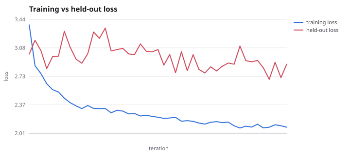
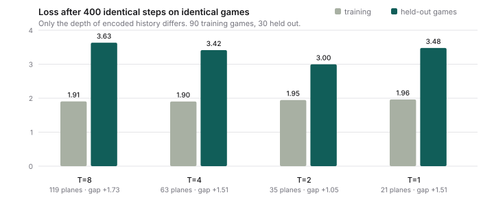

# neuralchess

[](https://github.com/tmseils-eng/neuralchess/actions/workflows/ci.yml)
[](https://www.python.org/)
[](requirements.txt)
[](LICENSE)

**An AlphaZero-style chess engine written from scratch — the rules, the neural
network, the autograd engine, and the search.**

The only runtime dependency is NumPy. There is no `python-chess`, no PyTorch
in the default path, no web framework. Move generation is a bitboard engine
verified against the standard perft suite; the policy-value network is a
residual CNN trained by backpropagation code in this repository; the search is
batched PUCT Monte-Carlo tree search. It learns to play from nothing but the
rules of chess and games against itself.

<p align="center">
  
</p>

```bash
git clone https://github.com/tmseils-eng/neuralchess && cd neuralchess
pip install -e .                    # numpy, and nothing else
python -m neuralchess serve --checkpoint assets/neuralchess-t2-5x48.npz --open
```

That opens the interface above and you play the thing — a trained network
ships with the repository, so nothing has to be trained first. The right panel
is the search itself: the moves it is considering, how many simulations each
received, and the value it assigns them.

```bash
make test                              # 57 tests, NumPy is the only dependency
python -m neuralchess perft --depth 4  # verify the rules engine: 197,281 nodes
python -m neuralchess train --config configs/tiny.json   # a few-minute run
```

---

## What is actually in here

| | |
| --- | --- |
| **Chess rules** | Bitboard move generation with classical ray attacks, Zobrist hashing, all four draw rules, SAN and PGN. Verified by perft on six standard positions. → [docs](docs/chess-engine.md) |
| **Position encoding** | AlphaZero's 119 × 8 × 8 input planes with eight steps of history, and the 4,672-way policy head as a verified bijection on legal moves. → [docs](docs/encoding.md) |
| **Neural network** | Residual tower with squeeze-and-excitation gating and a win/draw/loss value head, on a hand-written reverse-mode autograd engine (conv2d via im2col, batch norm, Adam/SGD, warmup-cosine schedules). Every gradient is checked numerically. → [docs](docs/network.md) |
| **Search** | Batched PUCT MCTS with virtual loss, first-play-urgency reduction, Dirichlet root noise, temperature scheduling, subtree reuse and a transposition cache. → [docs](docs/search.md) |
| **Training** | Parallel self-play, replay window, playout-cap randomisation, audited resignation, optional gating, resumable runs. → [docs](docs/training.md) |
| **Evaluation** | A fixed baseline ladder (random, material, alpha-beta, policy-only), paired-opening matches, and Elo by both closed-form inversion and multi-player maximum likelihood. → [docs](docs/training.md#measuring-strength) |
| **Interfaces** | A playable browser UI, a UCI engine for Arena/CuteChess/Lichess bots, a terminal client, and an SVG board renderer. → [docs](docs/interfaces.md) |
| **Engineering** | 57 tests that run with NumPy alone, GitHub Actions CI on three Python versions, a Docker image, and HTCondor/SLURM submit files for CHTC. |

<p align="center">
  
</p>

---

## Results

A 530K-parameter network (5 residual blocks × 48 channels, two steps of input
history) trained for **45 iterations — 1,800 self-play games, 2,025 gradient
steps, 2.0 hours on two CPU cores**. No GPU, no human games, no opening book,
no evaluation function: it starts from random weights and the rules.

Measured by round-robin, 12 games per pairing, 100 simulations per move,
paired openings, Elo fitted by maximum likelihood and anchored at `random = 0`:

```
  rating  player
  ------  ------
     648  material            one-ply greedy with piece-square tables
     344  material-noisy500   the same, with 500 cp of evaluation noise
     196  T8-baseline         the earlier 8-step-history network
     160  T2-adamw            this network
      47  policy-only         the network with the search removed
       0  random
```

Twelve games per pairing cannot separate the two networks. A dedicated
**120-game head-to-head** can, and its answer is that they are the same
strength: **+41 =46 −33, 53.3%, +23 Elo, 95% CI [−39, +87]**.

That is the honest result of the whole exercise, and it is worth stating
plainly. The review found the value head was memorising the replay window
rather than learning chess. Two candidate causes were tested; one was wrong
and one was right, the generalisation gap fell by more than half — **and
playing strength did not measurably change.**

What did change is cost. The shallow encoding gives **2× the inference
throughput and 2.4× the training throughput** for 6% fewer parameters. Equal
strength at half the compute is a real win, just not the one the hypothesis
predicted.

| | before | after |
| --- | --- | --- |
| held-out value loss (iteration 9) | 1.795 | **0.954** |
| generalisation gap (iteration 9) | +1.344 | **+0.589** |
| inference throughput | 253 pos/s | **511 pos/s** |
| playing strength | — | +23 Elo, CI [−39, +87] |

<p align="center">
  
  
</p>

Full tables, the ablation, and the comparison against the two earlier runs
that failed differently are in **[docs/results.md](docs/results.md)**.

Both trained networks ship with the repository, so you can play either
immediately:

```bash
python -m neuralchess serve --checkpoint assets/neuralchess-t2-5x48.npz --open
```

---

## Design decisions worth reading

A few choices in here are not the obvious ones, and the reasoning is written
down rather than assumed.

**The value head predicts win/draw/loss, not a scalar.** Chess draws
constantly, and a scalar trained on `z ∈ {−1, 0, +1}` cannot distinguish
"certainly drawn" from "equally likely to win or lose". Three softmax outputs
can. The search still consumes a scalar (`P(win) − P(loss)`), so nothing
downstream changes. [→](docs/network.md)

**The search caches expanded priors, not raw logits.** Caching the 4,672-wide
policy vector is the obvious implementation and a memory trap: 18 KB per entry
means a 100k-entry cache is 1.9 GB *per worker process*. Caching the legal
move list and its normalised priors instead is ~600 bytes for the same hit
rate. Finding this took a training run that sat at 12% CPU with a 3 GB
resident set. [→](docs/search.md)

**Autograd closures take the gradient as an argument.** The natural way to
write them — reading `out.grad` from inside the closure — creates a reference
cycle between a tensor and its own backward function. Python's cyclic
collector triggers on object counts, not bytes, so a training loop accumulates
entire computation graphs and is OOM-killed at several gigabytes. Passing the
gradient in leaves every reference pointing child → parent, and refcounting
frees each graph the moment the loss goes out of scope. [→](docs/network.md)

**Captures of the enemy king are never generated.** They only arise from
illegal positions, and generating one leaves the board kingless and corrupts
everything downstream. Excluding them makes the engine total on arbitrary FEN
input — which matters the moment a UI or a UCI GUI can send anything.
[→](docs/chess-engine.md)

**Indecisive self-play games are adjudicated on material.** The first full run
of this loop made the network *worse*: after forty iterations it lost a
round-robin to its own iteration-1 checkpoint. The loss curves looked fine the
whole time. The cause was that 72% of self-play games ended drawn on the move
limit, so three quarters of the value targets were exactly 0; the value head
learned that every position is drawn, the search lost its evaluation signal
and degenerated into sampling from the policy, and training the policy on that
search's visits trained the policy on itself. Policy entropy fell from 2.34 to
1.68 nats while strength went down. Adjudicating indecisive endings on
material cut the fraction of zero-valued targets from 1.00 to 0.12 and gave
the value head something to learn. `decisive_fraction` is now logged every
iteration, because it is the number that catches this and the loss is not.
[→](docs/training.md#the-draw-trap-and-how-the-first-run-failed)

**Training loss was measuring memorisation, so the loop now holds out games.**
The finished run reports a value loss of 0.246 — 78% average probability on
the correct outcome. On 525 positions from unseen games that same head scores
**2.238** cross-entropy and 41.5% accuracy against a 39.8% majority-class
baseline, with a 0.045 correlation to the actual result; it returns an
identical distribution whether White is a queen up or a queen down. The loop now holds out whole games — never individual positions, which would
leak the shared label — and logs `generalisation_gap` every iteration. Two
candidate causes were then tested rather than assumed: cutting the reuse ratio
from 12.6x to 2x changed nothing, while a controlled ablation on identical
games showed the input history stack is the real channel. Eight steps of
history is close to a fingerprint of the specific game, and every position in
a game shares one label. Training loss is flat across depths; only
generalisation moves.
[→](docs/training.md#what-actually-fixed-it-and-what-did-not)

**Playout-cap randomisation.** Most self-play moves get a small visit budget
and are not recorded; a minority get the full budget plus root noise and are.
Data quality is set by the recorded searches, throughput by the average one.
[→](docs/training.md)

**The baseline ladder includes the network without search.** Comparing
`policy-only` against the full MCTS agent isolates what the *search*
contributes from what the *network* contributes — an easy comparison to build
and a surprisingly common one to skip. [→](docs/training.md)

---

## Repository layout

```
neuralchess/
├── chess/            bitboards, move generation, SAN, PGN, perft
├── encoding/         119-plane input encoding, 4,672-way policy map
├── nn/               autograd engine, layers, the policy-value network
│   └── torch_backend.py   optional GPU/MPS mirror of the same architecture
├── search/           batched PUCT MCTS and the evaluation cache
├── selfplay/         game generation and the replay buffer
├── train/            training loop, losses, metrics, SVG plotting
├── evaluation/       baselines, arena, Elo estimation
├── uci.py            UCI protocol adapter
├── server.py         web UI backend (stdlib http.server)
├── render.py         SVG board renderer
└── cli.py            the single entry point

web/index.html        the playable browser UI, one self-contained file
configs/              tiny / laptop / cluster training configurations
scripts/              test runner, report generator, CHTC and SLURM jobs
tests/                57 tests: perft, gradient checks, search, training
docs/                 the design write-ups linked above
```

## Testing

```bash
make test           # pytest if installed, otherwise the bundled runner
make perft          # move generator correctness and speed
make lint           # ruff, plus a compile check that needs nothing installed
```

The suite covers the perft node counts for six standard positions,
make/unmake and Zobrist invariants under random play, the policy-map
bijection, central-difference gradient checks for every differentiable
operation, mate-finding by the search verified against brute-force ground
truth, self-play target consistency, the Elo estimators, the UCI protocol and
the web API — plus a full miniature training run end to end.

CI runs it on Python 3.9, 3.11 and 3.12, then repeats it in an environment
where **NumPy is the only installed package** to keep the zero-dependency
claim honest, and builds the Docker image.

## Scaling up

The laptop configuration is deliberately small. Two paths scale it:

```bash
condor_submit scripts/chtc/train.sub                 # UW-Madison CHTC
sbatch scripts/slurm/train.sbatch configs/cluster.json
```

Both rely on runs resuming from their own checkpoints, so a pre-empted job
loses at most one iteration. For GPU training,
`neuralchess/nn/torch_backend.py` mirrors the architecture in PyTorch and
reads and writes the same checkpoint format, so a network trained on a cluster
GPU plays here without conversion.

## References

- Silver et al., *Mastering Chess and Shogi by Self-Play with a General
  Reinforcement Learning Algorithm* (2017) — the AlphaZero algorithm, the
  input planes and the 4,672-move policy head.
- Silver et al., *Mastering the game of Go without human knowledge* (2017) —
  PUCT selection, Dirichlet root noise, the gating match.
- Wu, *Accelerating Self-Play Learning in Go* (KataGo, 2019) —
  playout-cap randomisation and resignation auditing.
- Hu et al., *Squeeze-and-Excitation Networks* (2018), and the Leela Chess
  Zero variant that emits a per-channel bias alongside the gate.

## License

MIT — see [LICENSE](LICENSE).
