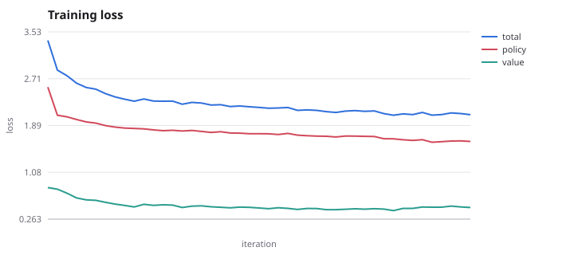
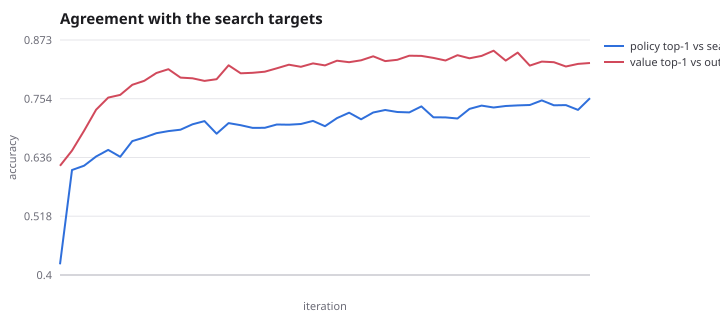
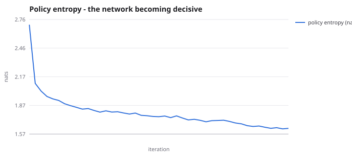
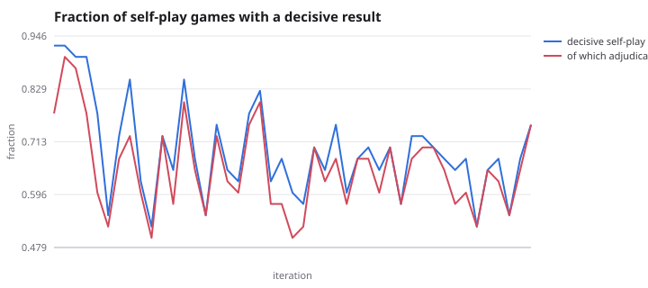
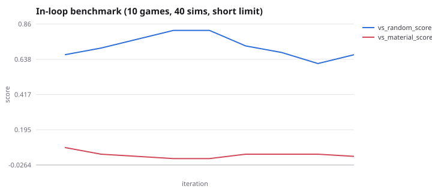

# Results

Everything on this page is regenerated by `scripts/report.py` from the run's
`metrics.jsonl` and its final checkpoint.

## The run

| | |
| --- | --- |
| network | 5 × 48 residual blocks with squeeze-excitation |
| iterations | 45 |
| self-play games | 1,800 |
| positions trained on | 30,000 in the replay window |
| gradient steps | 2,025 |
| simulations per recorded move | 128 (fast moves: 32) |
| self-play + training wall time | 2.0 h on 2 CPU workers |

## Learning curves








The in-loop benchmark is deliberately cheap - ten games at forty
simulations with a short move limit and no adjudication - so it is
noisy and it understates strength whenever a won game runs out of
moves. The round-robin below is the measurement to read.

| metric | first iteration | last iteration |
| --- | --- | --- |
| total loss | 3.377 | 2.083 |
| policy loss | 2.563 | 1.617 |
| value loss | 0.814 | 0.466 |
| policy top-1 vs search | 42.1% | 75.6% |
| policy entropy (nats) | 2.71 | 1.63 |

## Did the fixes work?

Three changes were made after the review: hold out whole games and report a
generalisation gap, drop the input history from eight steps to two, and use
decoupled weight decay. Each was tested rather than assumed.

### Reuse ratio: no effect

Cutting the replay reuse from 12.6x to ~2x (48 games, 30 steps per iteration)
changed nothing. Nine iterations in, the value head was diverging exactly as
before - training 0.581, held out 1.795 - and the run was stopped rather than
spending two more hours confirming a negative. It did isolate *which* head
fails: the policy generalised throughout (1.997 training / 2.128 held out)
while only the value head diverged.

### History depth: the actual channel

Four depths, same 120 games, same game-level split, same 400 steps, same seed:


| depth | planes | train | held out | gap | held-out value accuracy |
| --- | --- | --- | --- | --- | --- |
| T=8 | 119 | 1.906 | 3.633 | +1.727 | 0.59 |
| T=4 | 63 | 1.903 | 3.415 | +1.512 | 0.60 |
| T=2 | 35 | 1.946 | 2.996 | +1.050 | 0.69 |
| T=1 | 21 | 1.962 | 3.476 | +1.514 | 0.57 |

Training loss is flat across all four - every variant fits its data equally
well - so the only thing moving is generalisation. T=2 cuts the gap by 39% and
lifts held-out value accuracy by ten points. The result is not monotonic: T=1
is as bad as T=4, because one step cannot show what the opponent just moved.

### The combined run, measured against the old one

At matched iterations the T=2 + AdamW run generalises far better:

| | iteration 5 | iteration 9 |
| --- | --- | --- |
| T=8 value train / held out | 0.632 / 1.684 | 0.581 / 1.795 |
| T=2 value train / held out | 0.599 / 0.888 | 0.503 / 0.954 |

Held-out value loss is roughly **half**, and the gap is 2.7x smaller.

### Playing strength: no significant change

A 120-game head-to-head at 100 simulations, paired openings, 220-move limit,
rook adjudication:

**41 wins, 46 draws, 33 losses for the new network -
53.3%, +23 Elo, 95% CI [-39, +87],
likelihood of superiority 0.77.**

The interval comfortably includes zero. Better generalisation did *not* buy
measurable strength at this scale, and it would be dishonest to claim it did.
Note also how noisy short matches are: the same two networks were 12 games
apart at 66.7% in the round-robin below, which is inside the noise of the
120-game result.

What the change did buy is efficiency. At 5x48 the shallow encoding gives
**2x the inference throughput and 2.4x the training throughput** for 6% fewer
parameters. Equal strength at half the cost is a real win, just not the one
the hypothesis predicted.

### Ladder

12 games per pairing at 100 simulations - too few
to separate the two networks, and shown for the baseline anchoring rather than
for the comparison between them:

```
     648  material
     344  material-noisy500
     196  T8-baseline
     160  T2-adamw
      47  policy-only
       0  random
```
